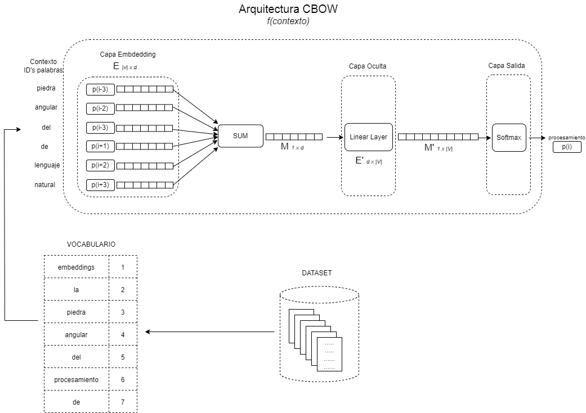

# MIA Embeddings experiment with PyTorch

Implementation of word2vec - [Efficient Estimation of Word Representations in Vector Space](https://arxiv.org/abs/1301.3781). An explanation of code is in my post - [Embeddings en el Modelo de Lenguaje MIA](https://edwinmoo.substack.com/p/embeddings-en-el-modelo-de-lenguaje?r=233vmr).

## MIA Embeddings experiment details

Choosen word2vec architecture for implementation is:

- Continuous Bag-of-Words Model (CBOW) - Predicts a central word based in its context (n-words before and after of a central word)

Experimental changes from original paper:

- Trained on spanish text corpus instead of google news.
- Context size is 4 and you can change it because is configurable.
- Adam optimizer for model instead of Adagrad from word2vec paper.
- 5 epochs of training. You can change this configurable parameter in case you want to run your own experiments.
- Applied regularization for embeddings computation is 1.

### Model Architecture


## Project Structure

```
.
├── README.md
├── requirements.txt
├── main.py
├── configs
│   └── mia.py
│   └── trainer_config.yaml
│   └── logging_config.yaml
├── data
├── dataloader
│   └── miaspanishcorpora.py
├── docs
├── utils
├── model
│   └── miacbowemb.py
├── training
│   └── miaembtrainer.py
└── embeddings
    └── MiaSpanishCorpora
```

- **configs/mia.py** - Defines global constants and configuration files.
- **data/** - Data for training and validation, you can add your own data if you want.
- **dataloader/miaspanishcorpora.py** - Deals with data loading for spanish corpora.
- **embeddings/** - Folder where expriments artifacts are stored, final model, losses, configuration and vocabulary.
- **model/miacbowemb.py** - Model definition, implements cbow architecture for model to train and validate.
- **training/miatrainer.py** - Defines the training loop.
- **main.py** - Entry point script for training, creates a trainer object and request train the model for a pre-configured number of epochs.

## How to start the training

```
Run below commands

1.- python -m venv miaembvenv
2.- source ./miaembvenv/bin/activate
3.- pip install -r requirements.txt
4.- python main.py --config_filepath configs/trainer_config.yml

```

In case you want to run experiments by your own change trainer parameters updating trainer_config.yaml file and lets see what happen

